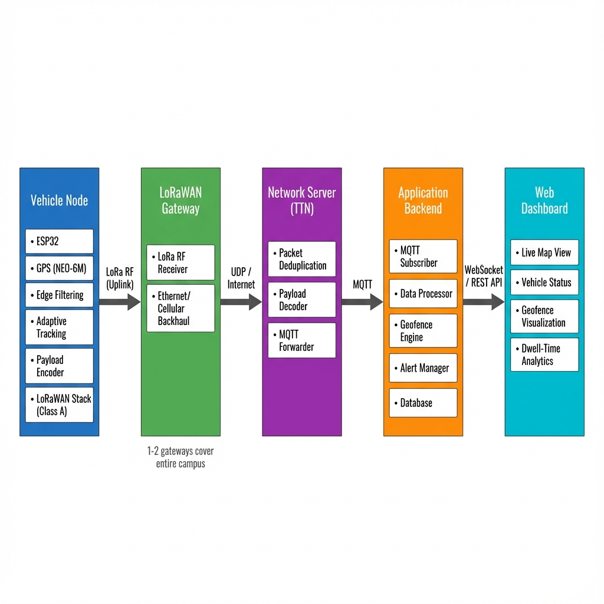
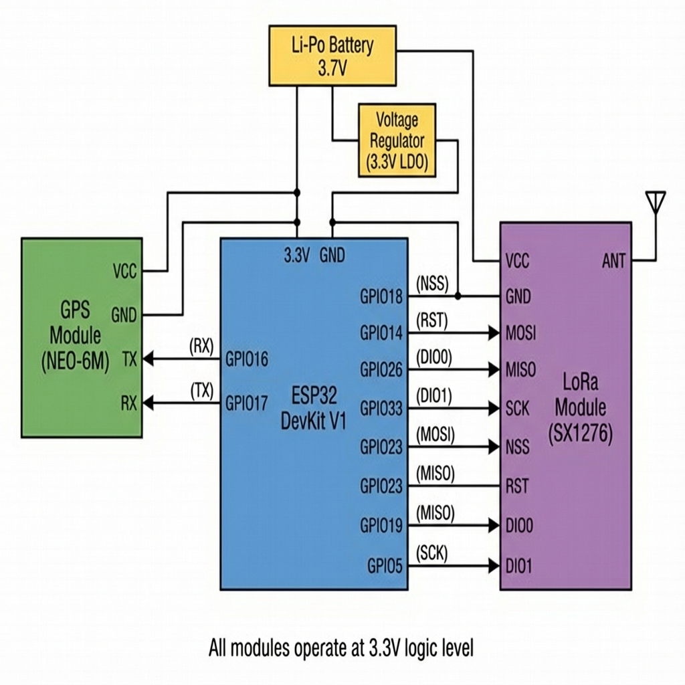

# Real-Time Vehicle Tracking System for Industrial Plants  
**ESP32 + GPS (NEO-6M) + LoRaWAN**

📍 **Project Status:** Prototype / Experimental System  
🧠 **Domain:** Embedded Systems · IoT · Low-Power Wireless  
🛠 **Primary Tech Stack:** ESP32, LoRaWAN, GPS, Python (Backend), MQTT, Cloud Dashboard  

---

## 1. Problem Definition

### Context
Large-scale industrial facilities such as **automotive manufacturing plants, mining zones, logistics yards, and shipping ports** often span **hundreds of acres (600+ acres)**.  
Within these campuses, hundreds of vehicles—test cars, forklifts, carriers, and service vehicles—move continuously across open yards and production zones.

### Core Problem
Plant operators lack **real-time visibility** into vehicle location, movement, and zone occupancy.

#### Why existing approaches fail:
- **Manual tracking** (QR codes / logbooks) is unreliable due to human error and poor compliance  
- **Wi-Fi-based systems** cannot cover such large areas without costly infrastructure  
- **Cellular (4G/LTE) trackers** introduce recurring SIM costs and high battery drain  
- No automated way to track **zone entry, exit, or dwell time**

### Impact
- ⏱ Operational delays during inspection and dispatch  
- 🚗 Poor asset utilization and congestion  
- ⚠️ Safety risks in restricted or hazardous zones  

---

## 2. System Objectives

The goal is to design a **low-power, long-range, and infrastructure-light vehicle tracking system** for large industrial campuses.

### Key Objectives
- **Campus-wide coverage** using minimal infrastructure (1–2 gateways)
- **Real-time tracking** with adaptive update intervals  
- **Low-power operation** for battery-powered nodes  
- **Automated geofencing** (no human input required)  
- **Cost-effective alternative** to cellular solutions  

---

## 3. Overall System Architecture

The system follows a **Device → Network → Cloud → Dashboard** architecture optimized for **intermittent connectivity**.

### High-Level Data Flow
[ Vehicle Node ]
|
(LoRa RF)
|
[ LoRaWAN Gateway ]
|
(Internet / UDP)
|
[ Network Server (TTN) ]
|
(MQTT)
|
[ Application Backend ]
|
[ Web Dashboard ]

### Architecture Diagram

---

## 4. Vehicle Node Design (Hardware)

The vehicle-mounted node is designed for **low power consumption** and **modular prototyping**.

### Hardware Components

| Component | Selected Part | Role |
|---------|--------------|------|
| MCU | ESP32 | Core processing, power management |
| GPS | U-blox NEO-6M | Location acquisition |
| LoRa | SX1276 / SX1278 | Long-range wireless uplink |
| Power | 3.7V Li-Po | Portable energy source |

### Design Considerations
- GPS is duty-cycled to reduce power consumption  
- ESP32 deep-sleep modes are used aggressively  
- System designed for easy upgrade (IMU / Solar input in future)

📷 **Wiring Diagram:**  

---

## 5. Firmware Architecture

The firmware is **event-driven** and optimized for **maximum sleep time**.

### Functional Blocks
- GPS Manager (NMEA parsing)
- Edge Filtering Logic
- Adaptive Tracking Controller
- LoRaWAN Uplink Manager
- Power Manager

### Firmware Flow
Wake → GPS Fix → Filter → Encode Payload → Transmit → Sleep

### Adaptive Tracking Logic
- **Moving vehicle:** 30–60s updates  
- **Stationary vehicle:** 5–10 min heartbeat  

📄 Detailed design:  
[`docs/firmware/firmware_architecture.md`](docs/firmware/firmware_architecture.md)

---

## 6. LoRaWAN Communication Design

- **Protocol:** LoRaWAN Class A  
- **Reason:** Lowest power consumption  
- **Region:** IN865 / EU868 / US915  
- **ADR:** Enabled  

### Payload Design
- Binary encoded payload (no JSON)
- Compact latitude & longitude representation

## 7. Dashboard & Geofencing Logic

### Features
- Live map visualization
- Vehicle markers & trails
- Polygon-based geofencing
- Entry / Exit alerts
- Dwell-time analytics

### Geofencing Logic
- Zones defined as polygons
- Point-in-polygon algorithm checks location
- State transitions trigger alerts

📷 Geofence Logic Diagram:

## 8. Novel Contributions

This project goes beyond a basic GPS tracker through:

- 🔋 Power-aware adaptive tracking
- 🧠 Edge-level GPS filtering
- ⏱ Zone-based dwell-time analytics
- 📡 Fault-tolerant data handling
- 📊 Comparative evaluation vs Wi-Fi and cellular

## 9. Results & Observations (Prototype Phase)

- Coverage: >2 km in urban test conditions
- Latency: ~2–5 seconds end-to-end
- Reliability: Superior penetration vs Wi-Fi
- Power: Estimated 3–5 days on 2000mAh battery
  (Weeks possible with aggressive sleep optimization)

📄 Details:
- docs/results/coverage_test.md
- docs/results/power_estimation.md

## 10. Limitations

- GPS does not work indoors or under metal sheds
- LoRaWAN Class A limits downlink responsiveness
- Consumer-grade GPS accuracy (~2.5–5 m drift)

## 11. Future Improvements

- ☀️ Solar-powered LoRaWAN gateways
- 📡 Hybrid indoor positioning (Wi-Fi sniffing)
- 🔁 Node-RED automation for alerts
- 🚗 IMU-based motion detection
- 🧩 ERP / MES system integration via MQTT

## 12. Conclusion

This project demonstrates a scalable, cost-effective, and low-power vehicle tracking system for industrial environments.
By combining LoRaWAN's range with embedded edge intelligence, the system bridges the visibility gap in plant logistics and asset movement.

## License
MIT License
