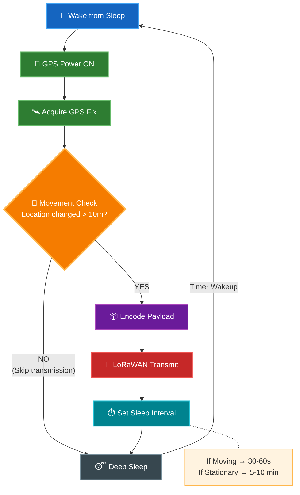
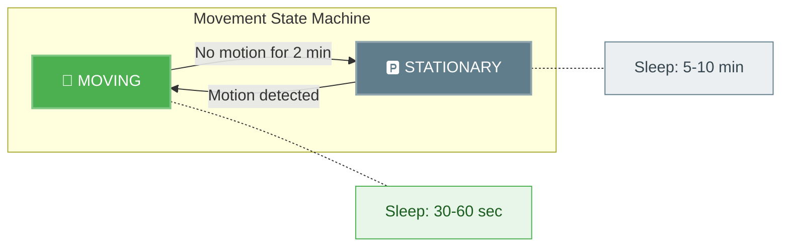

# Data Flow & Firmware Logic

## Adaptive Tracking Logic (NOVELTY ⭐)

## Key Optimizations

| Technique | Benefit |
|-----------|---------|
| **Edge Filtering** | Skip transmission if location unchanged (saves airtime) |
| **Adaptive Sleep** | 10x longer sleep when stationary (saves battery) |
| **GPS Power Gating** | Only power GPS when needed |

> [!IMPORTANT]
> This adaptive logic is the **novelty** of the project — it differentiates from simple fixed-interval trackers
