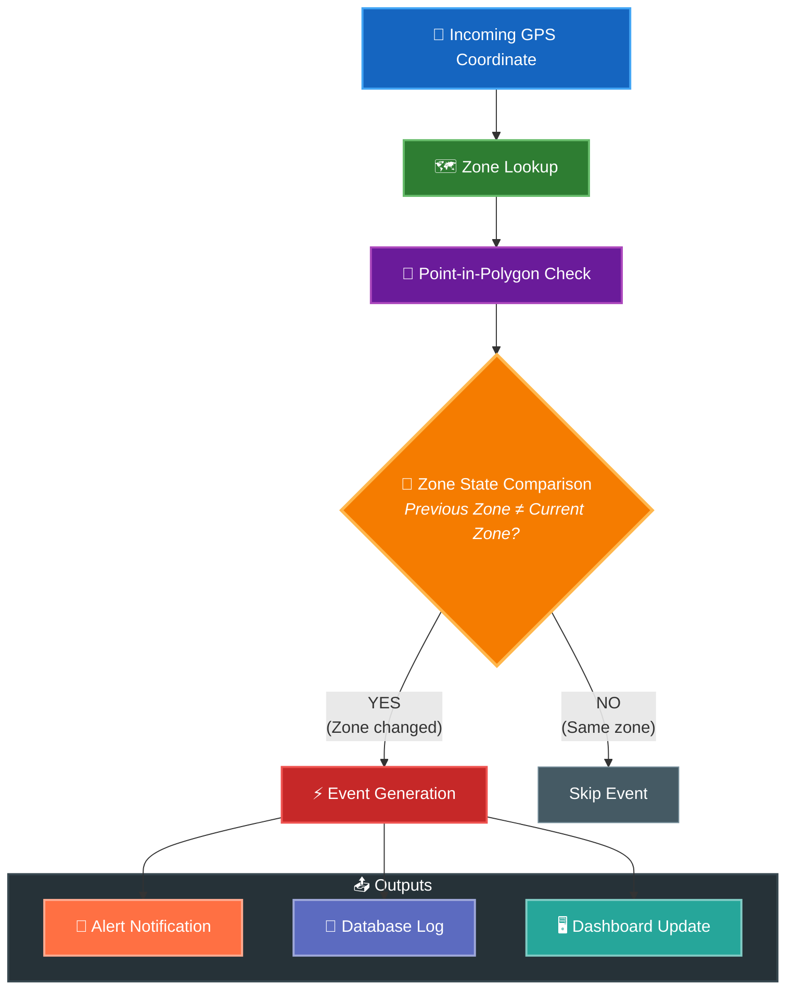
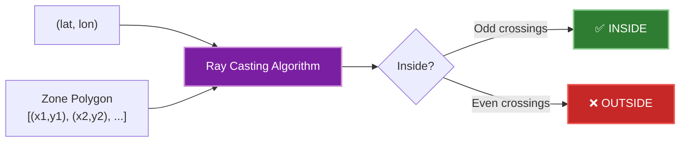
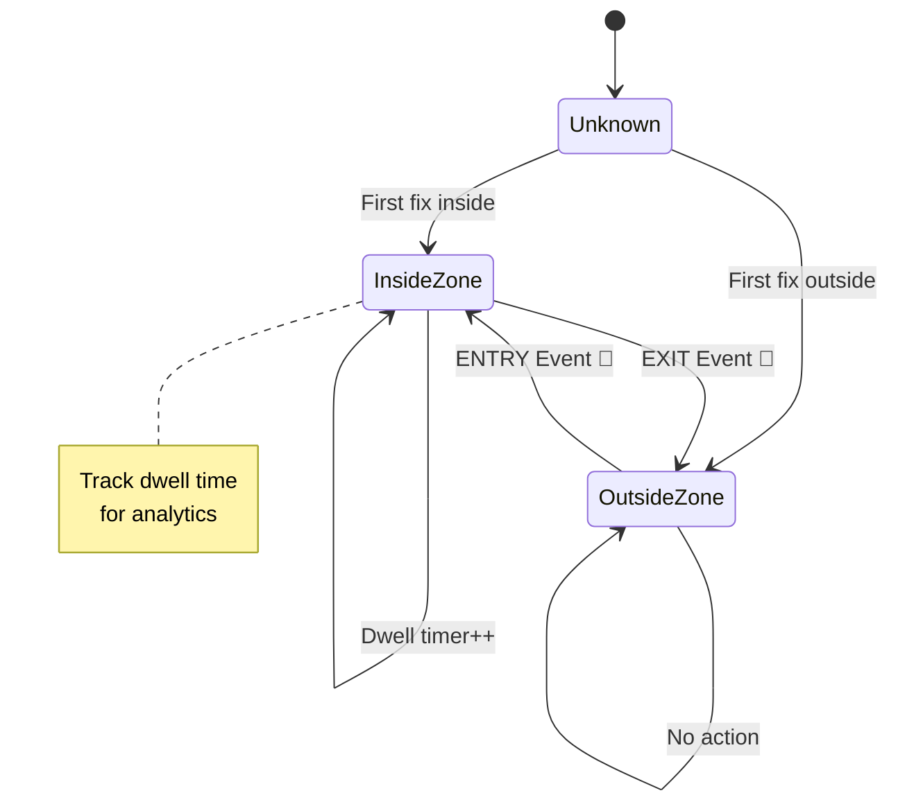

# Geofencing Logic

## Point-in-Polygon Algorithm

## Zone State Machine

## Event Types

| Event | Trigger | Action |
|-------|---------|--------|
| **ENTRY** | Vehicle enters geofence | Log + Dashboard notification |
| **EXIT** | Vehicle leaves geofence | Log + Alert (if restricted) |
| **DWELL** | Vehicle stationary > threshold | Dwell-time analytics update |

> [!NOTE]
> Geofencing is implemented entirely in the **backend** (software layer), not on the embedded device. This allows flexible zone management without firmware updates.
