# Hardware Wiring Diagram

> **Render this:** Paste into [mermaid.live](https://mermaid.live) or view in VS Code/GitHub

## Complete Wiring Schematic

```mermaid
flowchart TB
    subgraph POWER["🔋 Power Supply"]
        LIPO["Li-Po Battery<br/>3.7V 1000mAh"]
        REG["Voltage Regulator<br/>3.3V Output"]
    end

    subgraph ESP["🎛️ ESP32 DevKit V1"]
        direction TB
        ESP_TITLE["<b>ESP32-WROOM-32</b>"]
        
        subgraph UART["UART1 (GPS)"]
            GPIO16["GPIO16 (RX)"]
            GPIO17["GPIO17 (TX)"]
        end
        
        subgraph SPI["SPI (LoRa)"]
            GPIO23["GPIO23 (MOSI)"]
            GPIO19["GPIO19 (MISO)"]
            GPIO18_SCK["GPIO18 (SCK)"]
        end
        
        subgraph LORA_CTRL["LoRa Control"]
            GPIO5["GPIO5 (NSS)"]
            GPIO14["GPIO14 (RST)"]
            GPIO26["GPIO26 (DIO0)"]
            GPIO33["GPIO33 (DIO1)"]
            GPIO32["GPIO32 (DIO2)"]
        end
        
        VIN["VIN (5V)"]
        GND_ESP["GND"]
        V3_3["3.3V OUT"]
    end

    subgraph GPS["📍 GPS Module (NEO-6M)"]
        GPS_VCC["VCC"]
        GPS_GND["GND"]
        GPS_TX["TX"]
        GPS_RX["RX"]
    end

    subgraph LORA["📡 LoRa Module (SX1276/RFM95)"]
        LORA_VCC["VCC (3.3V)"]
        LORA_GND["GND"]
        LORA_MOSI["MOSI"]
        LORA_MISO["MISO"]
        LORA_SCK["SCK"]
        LORA_NSS["NSS"]
        LORA_RST["RST"]
        LORA_DIO0["DIO0"]
        LORA_DIO1["DIO1"]
        LORA_DIO2["DIO2"]
        LORA_ANT["ANT (Antenna)"]
    end

    %% Power Connections
    LIPO -->|"+"| REG
    REG -->|"3.3V"| V3_3
    LIPO -->|"-"| GND_ESP

    %% GPS Connections
    V3_3 -->|"3.3V"| GPS_VCC
    GND_ESP -->|"GND"| GPS_GND
    GPS_TX -->|"UART"| GPIO16
    GPIO17 -->|"UART"| GPS_RX

    %% LoRa Connections
    V3_3 -->|"3.3V"| LORA_VCC
    GND_ESP -->|"GND"| LORA_GND
    GPIO23 -->|"SPI"| LORA_MOSI
    LORA_MISO -->|"SPI"| GPIO19
    GPIO18_SCK -->|"SPI"| LORA_SCK
    GPIO5 -->|"CS"| LORA_NSS
    GPIO14 -->|"RESET"| LORA_RST
    LORA_DIO0 -->|"IRQ"| GPIO26
    LORA_DIO1 -->|"IRQ"| GPIO33
    LORA_DIO2 -->|"IRQ"| GPIO32

    %% Styling
    style POWER fill:#ffeb3b,stroke:#f57f17,stroke-width:2px,color:#000
    style ESP fill:#1565c0,stroke:#42a5f5,stroke-width:3px,color:#fff
    style GPS fill:#4caf50,stroke:#81c784,stroke-width:2px,color:#fff
    style LORA fill:#9c27b0,stroke:#ce93d8,stroke-width:2px,color:#fff
```



---

## Pin Mapping Table

| ESP32 Pin | Function | Connected To | Notes |
|-----------|----------|--------------|-------|
| **GPIO16** | UART1 RX | GPS TX | Serial data from GPS |
| **GPIO17** | UART1 TX | GPS RX | Serial data to GPS |
| **GPIO23** | SPI MOSI | LoRa MOSI | Master Out Slave In |
| **GPIO19** | SPI MISO | LoRa MISO | Master In Slave Out |
| **GPIO18** | SPI SCK | LoRa SCK | SPI Clock |
| **GPIO5** | CS | LoRa NSS | Chip Select |
| **GPIO14** | Digital | LoRa RST | Module Reset |
| **GPIO26** | Interrupt | LoRa DIO0 | TX/RX Complete |
| **GPIO33** | Interrupt | LoRa DIO1 | CAD Done |
| **GPIO32** | Interrupt | LoRa DIO2 | FHSS Change |
| **3.3V** | Power | GPS VCC, LoRa VCC | 3.3V logic level |
| **GND** | Ground | All GND | Common ground |

---

## Simple Connection Diagram (ASCII)

```
┌─────────────────────────────────────────────────────────────────┐
│                         WIRING OVERVIEW                          │
└─────────────────────────────────────────────────────────────────┘

                    ┌──────────────┐
                    │   Li-Po      │
                    │   Battery    │
                    │   3.7V       │
                    └──────┬───────┘
                           │
                    ┌──────▼───────┐
                    │   Voltage    │
                    │   Regulator  │
                    │   3.3V Out   │
                    └──────┬───────┘
                           │
         ┌─────────────────┼─────────────────┐
         │                 │                 │
         ▼                 ▼                 ▼
┌─────────────┐    ┌───────────────┐    ┌─────────────┐
│  GPS Module │    │    ESP32      │    │ LoRa Module │
│   NEO-6M    │    │  DevKit V1    │    │   SX1276    │
│             │    │               │    │             │
│  TX ────────┼───►│ GPIO16 (RX)   │    │             │
│  RX ◄───────┼────│ GPIO17 (TX)   │    │             │
│             │    │               │    │             │
│             │    │ GPIO23 ───────┼───►│ MOSI        │
│             │    │ GPIO19 ◄──────┼────│ MISO        │
│             │    │ GPIO18 ───────┼───►│ SCK         │
│             │    │ GPIO5  ───────┼───►│ NSS         │
│             │    │ GPIO14 ───────┼───►│ RST         │
│             │    │ GPIO26 ◄──────┼────│ DIO0        │
│             │    │ GPIO33 ◄──────┼────│ DIO1        │
│             │    │ GPIO32 ◄──────┼────│ DIO2        │
│             │    │               │    │             │
│  VCC ◄──────┼────│ 3.3V ─────────┼───►│ VCC         │
│  GND ◄──────┼────│ GND ──────────┼───►│ GND         │
│             │    │               │    │        ───► │ ANT (Antenna)
└─────────────┘    └───────────────┘    └─────────────┘
```

---

## Important Notes

> [!IMPORTANT]
> **All modules operate at 3.3V logic level.** Do NOT connect 5V directly to GPS or LoRa modules.

> [!NOTE]
> Pin numbers are configurable in `config.h`. Update firmware if using different GPIO pins.

> [!TIP]
> For prototype testing, use breadboard jumper wires. For permanent installation, consider a custom PCB.

---

## Bill of Materials (BOM)

| Component | Model | Quantity | Purpose |
|-----------|-------|----------|---------|
| Microcontroller | ESP32 DevKit V1 | 1 | Main processor |
| GPS Module | u-blox NEO-6M | 1 | Location tracking |
| LoRa Module | SX1276 / RFM95W | 1 | LoRaWAN communication |
| Antenna | 868/915 MHz whip | 1 | LoRa RF antenna |
| Battery | Li-Po 3.7V 1000mAh | 1 | Power source |
| Regulator | AMS1117-3.3 | 1 | Voltage regulation |
| Jumper Wires | Male-Male | ~20 | Connections |

---

## Firmware Pin Verification

These pins match the configuration in [`config.h`](../../firmware/include/config.h):

```c
// GPS Configuration
#define GPS_RX_PIN            16
#define GPS_TX_PIN            17

// LoRa SPI Pins
#define LORA_NSS_PIN          5
#define LORA_RST_PIN          14
#define LORA_DIO0_PIN         26
#define LORA_DIO1_PIN         33
#define LORA_DIO2_PIN         32
```
